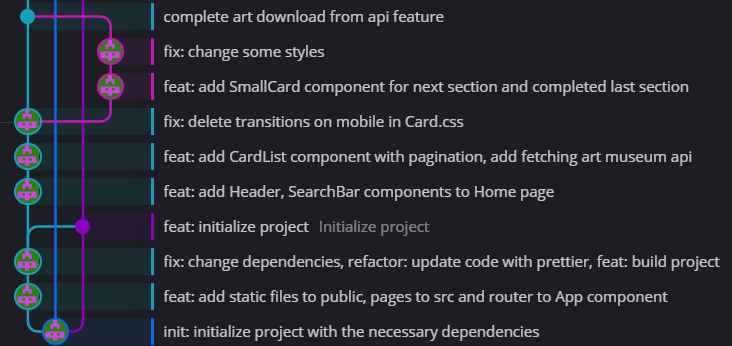

# Tестовое задание Modsen Art Museum (Результат правок)

## Задание

### Определил пробелы

#### 1. Git Flow
> Выделил для себя следующие задачи:
> 
> - Переименовать коммиты начиная с первого в ветке `main`
> - Разделить коммиты с многочисленными изменениями по изменениям
> - Поместить коммиты с `docs:` в ветке `docs`
> - Коммиты на ветке `dev` поместить на `feature`/`bugfix`
>
> Выполнил:
> 
> - Все последующие коммиты делал полноценными - коммит на определенную итерацию
> - Декомпозировал коммиты на несколько конкретных
> - Перебазировал ветку `gh-pages` на коммит инициализации `init:`
> 
> 

> - Сделал ошибку и разместил коммиты из ранее созданной ветки `release/structure` на `dev` (заметил только при документировании)
> 
> 

### Выделил следующие пункты

| Name                                                                                             | Assign | Status      |
|--------------------------------------------------------------------------------------------------|--------|-------------|
| ~~Не полностью велась разработка по git flow~~                                                   | Daniil | In progress |
| Документация                                                                                     | Daniil | Done        |
| Подключить алиасы                                                                                | Daniil | Done        |
| Удалить css                                                                                      | Daniil | Done        |
| Общая тема стилей — ThemeProvider                                                                | Daniil | Done        |
| Подключить simple-import-sort для правильного порядка импортов                                   | Daniil | Done        |
| Объявлять цвета в едином стиле (RGBA)                                                            | Daniil | Done        |
| Дебаунс                                                                                          | Daniil | Done        |
| Husky                                                                                            | Daniil | Done        |
| Пересмотреть что должно быть в dependencies, а что в devDependencies                             | Daniil | Done        |
| Пересмотреть папку constants                                                                     | Daniil | Done        |
| Не нагружать сеттеры логикой (setFavorites), вынести ее выше и уже засетать необходимой значение | Daniil | Done        |
| Пересмотреть использование useEffect(FavoriteCardList)                                           | Daniil | Done        |
| Использовать для оптимизации memo/useCallback/useMemo; Использовать связку useCallback+memo      | Daniil | Done        |
| Не использовать инлайн-функции, они могут влиять на производительность                           | Daniil | Done        |
| Глобальные переменные, магические числа, camelCase                                               | Daniil | Done        |
| Не нагружать логикой компоненты и вынести ее в utils, либо helpers(например, SearchResultsList)  | Daniil | Done        |
| При перезагрузке страницы favorites - 404                                                        | Daniil | Done        |
| Статичные данные выносить отдельно                                                               | Daniil | Done        |
| Не использовать index в качестве ключа при маппинге                                              | Daniil | Done        |
| Использовать для компонентов именованный экспорт, чтобы избежать ошибок с неймингом              | Daniil | Done        |
| Не верно организована файловая структура папок компонентов                                       | Daniil | Done        |
| Исправить тесты                                                                                  | Daniil | Done        |
| Ошибки при запросах выводит на UI, не только в консоль                                           | Daniil | Done        |
| Не использовать any для типизации                                                                | Daniil | Done        |
| Чистота кода                                                                                     | Daniil | Done        |
| Не нарушать принцип DRY                                                                          | Daniil | Done        |
| Вынести инлайн-стили отдельно                                                                    | Daniil | Done        |
| Кастомные хуки, Вынести useDebounce в папку hooks                                                | Daniil | Done        |

## Тестирование

### Изменения тестов

Для проверки использовал: `jest --coverage`

| File                                   | % Stmts | % Branch | % Funcs | % Lines | Uncovered Line #s    |
|----------------------------------------|---------|----------|---------|---------|----------------------|
| All files                              |   91.72 |    85.33 |   81.36 |   92.37 |                      |
| api                                    |   81.81 |    45.45 |      75 |   79.62 |                      |
| artworks.ts                            |   93.33 |      100 |     100 |      90 | 14                   |
| fetchData.ts                           |     100 |       60 |     100 |     100 | 5-13                 |
| fetchGlobalData.ts                     |   72.72 |        0 |     100 |   73.68 | 21-27                |
| images.ts                              |   85.71 |        0 |     100 |      80 | 6                    |
| search.ts                              |   55.55 |        0 |       0 |   57.14 | 7-10                 |
| urls.ts                                |   84.61 |      100 |   66.66 |   83.33 | 6                    |
| components/Footer                      |     100 |      100 |     100 |     100 |                      |
| Footer.tsx                             |     100 |      100 |     100 |     100 |                      |
| index.ts                               |     100 |      100 |     100 |     100 |                      |
| styled.ts                              |     100 |      100 |     100 |     100 |                      |
| components/GallerySection              |     100 |      100 |     100 |     100 |                      |
| GallerySection.tsx                     |     100 |      100 |     100 |     100 |                      |
| index.ts                               |     100 |      100 |     100 |     100 |                      |
| styled.ts                              |     100 |      100 |     100 |     100 |                      |
| components/Header                      |     100 |      100 |     100 |     100 |                      |
| Header.tsx                             |     100 |      100 |     100 |     100 |                      |
| index.ts                               |     100 |      100 |     100 |     100 |                      |
| styled.ts                              |     100 |      100 |     100 |     100 |                      |
| components/Pagination                  |     100 |    95.45 |     100 |     100 |                      |
| Pagination.tsx                         |     100 |     87.5 |     100 |     100 | 26                   |
| index.ts                               |     100 |      100 |     100 |     100 |                      |
| styled.ts                              |     100 |      100 |     100 |     100 |                      |
| components/SearchBar                   |     100 |      100 |     100 |     100 |                      |
| SearchBar.tsx                          |     100 |      100 |     100 |     100 |                      |
| index.ts                               |     100 |      100 |     100 |     100 |                      |
| styled.ts                              |     100 |      100 |     100 |     100 |                      |
| components/SortDropdown                |     100 |      100 |     100 |     100 |                      |
| SortDropdown.tsx                       |     100 |      100 |     100 |     100 |                      |
| index.ts                               |     100 |      100 |     100 |     100 |                      |
| styled.ts                              |     100 |      100 |     100 |     100 |                      |
| components/cards/Card                  |     100 |      100 |   66.66 |     100 |                      |
| Card.tsx                               |     100 |      100 |     100 |     100 |                      |
| index.ts                               |     100 |      100 |       0 |     100 |                      |
| styled.ts                              |     100 |      100 |     100 |     100 |                      |
| components/cards/SmallCard             |     100 |    93.75 |     100 |     100 |                      |
| SmallCard.tsx                          |     100 |    83.33 |     100 |     100 | 53                   |
| index.ts                               |     100 |      100 |     100 |     100 |                      |
| styled.ts                              |     100 |      100 |     100 |     100 |                      |
| components/error/ErrorBoundary         |     100 |      100 |     100 |     100 |                      |
| ErrorBoundary.tsx                      |     100 |      100 |     100 |     100 |                      |
| index.ts                               |     100 |      100 |     100 |     100 |                      |
| styled.ts                              |     100 |      100 |     100 |     100 |                      |
| components/error/ErrorBoundaryWrapper  |     100 |      100 |     100 |     100 |                      |
| ErrorBoundaryWrapper.tsx               |     100 |      100 |     100 |     100 |                      |
| index.ts                               |     100 |      100 |     100 |     100 |                      |
| components/error/ErrorDisplay          |   95.23 |      100 |      75 |   94.11 |                      |
| ErrorDisplay.tsx                       |   93.33 |      100 |   66.66 |   91.66 | 20                   |
| index.ts                               |     100 |      100 |     100 |     100 |                      |
| styled.ts                              |     100 |      100 |     100 |     100 |                      |
| components/lists/CardList              |      95 |    83.33 |   66.66 |   92.85 |                      |
| CardList.tsx                           |   94.28 |       50 |      60 |   91.66 | 41,45                |
| index.ts                               |     100 |      100 |     100 |     100 |                      |
| styled.ts                              |     100 |      100 |     100 |     100 |                      |
| components/lists/SearchResultsList     |     100 |       75 |      80 |     100 |                      |
| SearchResultsList.tsx                  |     100 |       75 |     100 |     100 | 48                   |
| index.ts                               |     100 |      100 |       0 |     100 |                      |
| components/lists/SmallCardList         |     100 |      100 |     100 |     100 |                      |
| SmallCardList.tsx                      |     100 |      100 |     100 |     100 |                      |
| index.ts                               |     100 |      100 |     100 |     100 |                      |
| styled.ts                              |     100 |      100 |     100 |     100 |                      |
| constants                              |     100 |      100 |     100 |     100 |                      |
| art.ts                                 |     100 |      100 |     100 |     100 |                      |
| errors.ts                              |     100 |      100 |     100 |     100 |                      |
| favorites.ts                           |     100 |      100 |     100 |     100 |                      |
| home.ts                                |     100 |      100 |     100 |     100 |                      |
| paths.ts                               |     100 |      100 |     100 |     100 |                      |
| testValues.ts                          |     100 |      100 |     100 |     100 |                      |
| values.ts                              |     100 |      100 |     100 |     100 |                      |
| context                                |      95 |        0 |     100 |   94.44 |                      |
| FavoritesContext.tsx                   |      95 |        0 |     100 |   94.44 | 29                   |
| helpers                                |   83.33 |    66.66 |   82.35 |   80.53 |                      |
| artHelpers.tsx                         |   86.27 |       58 |   83.33 |   81.57 | 19-20,34-35,50,54-55 |
| favoritesHelpers.ts                    |     100 |      100 |     100 |     100 |                      |
| homeHelpers.ts                         |   28.57 |      100 |       0 |   27.77 | 13-34                |
| paginationHelpers.ts                   |     100 |      100 |     100 |     100 |                      |
| searchBarHelpers.ts                    |     100 |      100 |     100 |     100 |                      |
| searchResultsListHelpers.ts            |    90.9 |    66.66 |     100 |   88.88 | 11                   |
| smallCardHelpers.ts                    |     100 |    83.33 |     100 |     100 | 11                   |
| sortDropdownHelpers.ts                 |     100 |      100 |     100 |     100 |                      |
| sortHelpers.ts                         |   88.88 |       80 |     100 |   88.88 | 20                   |
| hooks                                  |   94.59 |      100 |   81.81 |   96.29 |                      |
| useDebounce.ts                         |     100 |      100 |     100 |     100 |                      |
| useErrorHandler.tsx                    |      90 |      100 |      50 |    87.5 | 11                   |
| useTimeout.ts                          |    92.3 |      100 |      80 |     100 |                      |
| pages/Art                              |     100 |      100 |     100 |     100 |                      |
| Art.tsx                                |     100 |      100 |     100 |     100 |                      |
| styled.ts                              |     100 |      100 |     100 |     100 |                      |
| pages/Art/ArtDetails                   |     100 |      100 |     100 |     100 |                      |
| ArtDetails.tsx                         |     100 |      100 |     100 |     100 |                      |
| index.ts                               |     100 |      100 |     100 |     100 |                      |
| styled.ts                              |     100 |      100 |     100 |     100 |                      |
| pages/Art/ArtOverview                  |     100 |      100 |     100 |     100 |                      |
| ArtOverview.tsx                        |     100 |      100 |     100 |     100 |                      |
| index.ts                               |     100 |      100 |     100 |     100 |                      |
| pages/Favorites                        |     100 |      100 |     100 |     100 |                      |
| Favorites.tsx                          |     100 |      100 |     100 |     100 |                      |
| pages/Favorites/FavoriteCardList       |     100 |       75 |     100 |     100 |                      |
| FavoriteCardList.tsx                   |     100 |       50 |     100 |     100 | 16                   |
| index.ts                               |     100 |      100 |     100 |     100 |                      |
| styled.ts                              |     100 |      100 |     100 |     100 |                      |
| pages/Home                             |   91.17 |    33.33 |   33.33 |   88.46 |                      |
| Home.tsx                               |   91.17 |    33.33 |   33.33 |   88.46 | 25-33                |
| styles                                 |   37.14 |    93.75 |   15.38 |   52.17 |                      |
| global.ts                              |   37.14 |    93.75 |   15.38 |   52.17 | 8-39                 |
| utils                                  |   94.44 |      100 |   83.33 |     100 |                      |
| camelCase.ts                           |    90.9 |      100 |      75 |     100 |                      |
| renderSmallCards.tsx                   |     100 |      100 |     100 |     100 |                      |

Test Suites: **16 passed**, 16 total

Tests:       **45 passed**, 45 total

## Полезные ссылки

[React](https://reactjs.org/docs/getting-started.html)
[React hooks](https://reactjs.org/docs/hooks-intro.html)
[Eslint](https://eslint.org/docs/user-guide/configuring)
[Prettier](https://prettier.io/docs/en/install.html)
[Styled-components](https://www.styled-components.com/docs)
[Husky](https://dev.to/ivadyhabimana/setup-eslint-prettier-and-husky-in-a-node-project-a-step-by-step-guide-946)
[GitFlow](https://www.atlassian.com/ru/git/tutorials/comparing-workflows/gitflow-workflow)
[Commit Convention](https://www.conventionalcommits.org/en/v1.0.0/)
